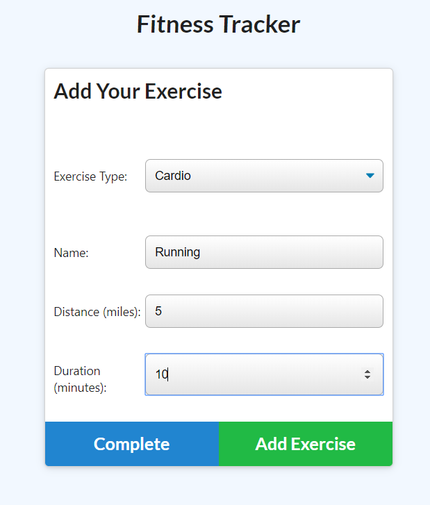
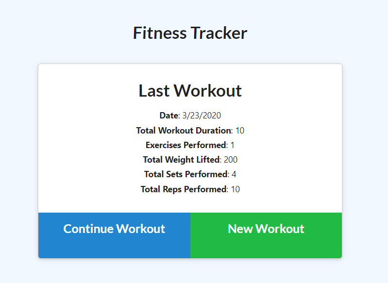
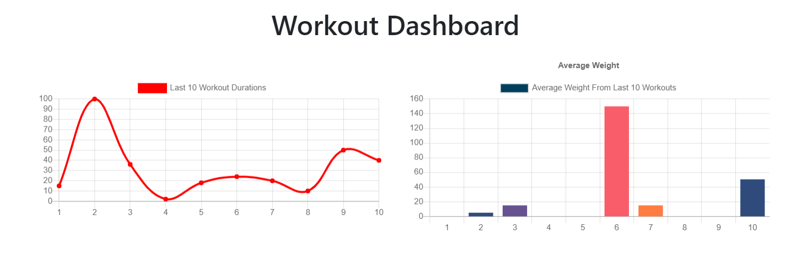

# Workout Tracker

This is an app that tracks a user's workouts so they can compare their recent activity flow. This was an app where I was provided with the entire front end code, and I had to write:

- The front end (HTML) view route
- The API routes
- The Models to interact with the Mongo DataBase
- The server.js file

in order to tie it all together and make it functional.

Check out the repo [here](https://github.com/agtravis/workout-tracker), and see the app in operation [here](https://agtravis-workout-tracker.herokuapp.com/).

This app runs in the browser - see [Setup](#setup) below for instructions on how to use.

## Table of contents

- [Screenshots](#screenshots)
- [Technologies](#technologies)
- [Code Examples](#code-examples)
- [Setup](#setup)
- [Features](#features)
- [Status](#status)
- [Contact](#contact)

## Screenshots

Enter your workout...

...if you worked out more than once in a session (calendar day), add this workout.

View the compiled reports of your most recent 10 workouts with chart.js

## Technologies

This app does utilize various front-end technologies (such as [`chart.js`](https://www.chartjs.org/)), however since I only worked on the back-end, I will focus on what I added.

Aside from the routing, both views and API requests, the main focus of my work on this app was the interactions with the Mongo database via the Mongoose schemas I have written. I will go into more detail in the next section.

## Code Examples

### Models

I decided for this project that I would keep two seperate models for the different types of excercises. My reason for doing this was that it made sense to keep different types of matching information seperate, even though the app's front end does not require this, it may be useful to have this ready to go for future developement. It would also be possible to break apart this information, however if I set the foundations this way to begin with, they wouldn't need to be reverse engineered at that point.

    const mongoose = require(`mongoose`);
    const Schema = mongoose.Schema;
    const Workout = new Schema({
        day: {
            type: Date,
            default: Date.now
        },
        exercises: [],
        resistance: [
            {
                type: Schema.Types.ObjectId,
                ref: `Resistance`
            }
        ],
        cardio: [
            {
                type: Schema.Types.ObjectId,
                ref: `Cardio`
            }
        ]
    });
    module.exports = mongoose.model(`Workout`, Workout);

This is the model for the Workout. This gets created (`'C'RUD`) when the user selects 'New Workout'. In this case, I do have an exercises empty array in the model, this exists so that if the `seed.js` file is used, the seed has somewhere to go. I do not use this file, nor do I do anything with this array if it exists. Instead, I have a seperate array for the two different types of exercises, 'resistance' and 'cardio'. If the app was updated to include a new type of activity, this model would need to be updated, but it would not corrupt or make obselete any data already recorded (although a migration of data might be required to protect existing data). In addition, the route would need to be updated to include this new 'type' of workout.

The models for the types of exercises are essentially classes that validate input before pushing the `id` to the array for the workout, so a `population` can occur - this is MongoDB's version of SQL's `JOIN` syntax. This happens in the model definition where the arrays have 'rules' as to what pushes `ref` (reference). This is how the model knows that the only item actually being pushed (The ID of the workout) can be extrapolated out into a complete object.

The 'type' property of an object is used in the API route to decide which array to populate:

    app.put(`/api/workouts/:id`, (req, res) => {
        if (req.body.type === 'cardio') {
            db.Cardio.create(req.body)
                .then(({ _id }) =>
                db.Workout.findOneAndUpdate(
                    { _id: mongoose.Types.ObjectId(req.params.id) },
                    {
                        $push: { cardio: _id }
                    },
                    { new: true }
                )
                ).then(dbWorkout => {
                res.json(dbWorkout);
                })
                .catch(err => {
                res.json(err);
            });
        } else if (req.body.type === `resistance`) {
            // similar code as above except the line:
                $push: { resistance: _id }
        }
    });

What this does is it first checks the specific property of the `request.body` which contains the type, then runs down the appropriate code path. A new object document is created in the appropriate document collection (SQL `table`), then it takes the id of the workout session being passed via the URL (the URL maintains via the front end code the id in session), and then takes the newly created ID of the workout created, and pushes this ID into the appropriate array of the workout model, ready to be `populated` as required.

    app.get(`/api/workouts/range`, (req, res) => {
        db.Workout.find({})
        .populate(`cardio`)
        .populate(`resistance`)
        .then(result => {
            let condition = 10;
            if (result.length < 10) {
                condition = result.length;
            }
            result.sort((a, b) => b.day - a.day);
            const workoutArray = [];
            for (let i = 0; i < condition; ++i) {
                const day = {};
                day._id = result[i]._id;
                day.day = result[i].day;
                day.exercises = [];
                day.totalDuration = 0;
                result[i].resistance.forEach(exercise => {
                    day.exercises.push(exercise);
                    day.totalDuration += exercise.duration;
                });
                result[i].cardio.forEach(exercise => {
                    day.exercises.push(exercise);
                    day.totalDuration += exercise.duration;
                });
                day.__v = result[i].__v;
                workoutArray.push(day);
            }
            res.json(workoutArray);
        })
        .catch(err => {
            res.json(err);
        });
    });

The above is the code that ensures that the front end receives the exact data it requires to populate the `chart.js` visual display, from the information stored in the database. It should be pretty straightforward, however the key takeaways are:

- The populations occur first (after the data is requested with `find({})`).
- The front-end only displays the 10 most recent workouts, so this route ensures that happens
- the return data is structured (and calculated) to align with how the front-end is expecting data - the exercises array is being filled

## Setup

To set up this app as a user, you simply go to the website [here](https://agtravis-workout-tracker.herokuapp.com/). The 'open' workout session is kept in session via the URL, so no sign up is required.

As a developer, I have also included in the API routes a `delete` route:

    app.delete(`/api/workouts/:id`, (req, res) => {
        db.Workout.deleteOne({
            _id: mongoose.Types.ObjectId(req.params.id)
        })
        .then(deleted => {
            res.json(deleted);
        })
        .catch(err => {
            res.json(err);
        });
    });

This is never called in the front end, but I used it frequently (via [Postman](https://www.postman.com/)) in order to ensure consistency in my data through development.

## Features

This app has a simple UI so that users can instantly start using it. It is very basic, but provides useful information. Since I was not responsible for any front end, I do not need to go into specifics.

## Status & Future Developement

This app would be far more useful if, instead of keeping a current session active via the URL, some sort of sign in feature was enabled. This would mean that more than one user would be able to use the same instance of the app (for my link, any user can update or add workouts).

## Contact

Created by [@agtravis](https://agtravis.github.io/)
